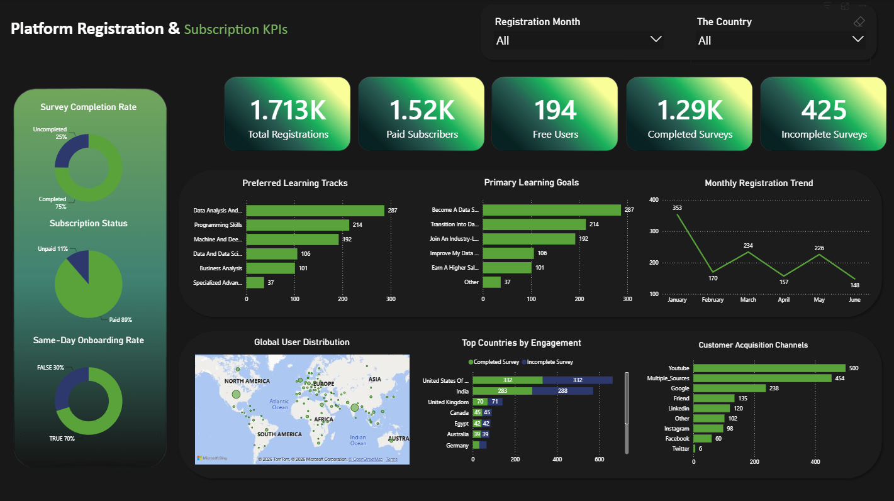

# Platform Registration & Subscription KPIs Analysis 📊

## 📌 Project Overview
This project focuses on analyzing user registration behaviors and subscription key performance indicators (KPIs) for a platform. The goal of this analysis is to understand user onboarding journeys, identify the most effective acquisition channels, and uncover actionable insights to improve conversion rates and business strategies.

## 🛠️ Tools & Technologies Used
* **Data Cleaning & Manipulation:** Microsoft Excel
* **Data Modeling & Visualization:** Microsoft Power BI
* **Calculations:** DAX (Data Analysis Expressions)

## 🗂️ Project Workflow

### 1. Data Cleaning & Transformation (Excel)
The raw data was initially provided in a CSV format (`data_visualization.csv`). To prepare the data for accurate analysis, several data cleaning and feature engineering steps were performed:
* **Format Standardization:** Adjusted and standardized data formats across all columns.
* **Feature Engineering:** Added new calculated columns to deepen the analysis:
    * Extracted **Registration Month** and **Completion Month**.
    * Grouped dates into **Quarters** to track performance over time.
    * Created a **Same-Day Onboarding** flag (True/False) to identify users who registered and completed the onboarding survey on the exact same day.
* The cleaned and structured dataset was then exported to an Excel file (`Platform Registration & Subscription KPIs .xlsx`) ready for Power BI.

### 2. Data Modeling & DAX (Power BI)
The cleaned Excel data was imported into Power BI to build an interactive dashboard. Key measures and calculations created include:
* **Completion Rates:** Calculating the number of users who successfully completed the onboarding form versus those who dropped off.
* **Subscription Breakdown:** Segmenting users based on their subscription plans (Free vs. Paid).

## 📈 Key Findings & Insights
Through the Power BI dashboard, several critical insights were uncovered:
1. **High Engagement Rate:** Approximately **75.2%** of total registered users successfully completed the onboarding survey.
2. **Fast Onboarding:** An impressive **70.3%** of all users completed the onboarding process on the exact same day they registered, indicating a smooth UI/UX.
3. **Top Acquisition Channels:** The most successful channels for acquiring users are **YouTube** and **Google**.
4. **Primary User Goals:** The dominant goals among subscribers are making a "Career Transition into Data Science" and the desire to "Become a Data Scientist."

## 🎯 Business Recommendations
Based on the data analysis, I propose the following actionable recommendations to drive business growth:
1. **Optimize Marketing Spend:** Allocate a larger portion of the marketing and content creation budget to **YouTube**, as it has proven to be the most effective customer acquisition channel.
2. **Implement Retargeting Campaigns:** Launch targeted email marketing campaigns aimed at the ~25% of users who dropped off and did not complete the onboarding form to encourage their return.
3. **Product & Content Strategy:** Since the primary user goal is a "Career Shift", the platform should emphasize learning paths, projects, and marketing messaging that directly support career transitions into Data Science.
4. **Capitalize on Momentum:** Given that over 70% of users onboard on the same day, introduce immediate "time-sensitive discounts or fast-action offers" right after registration to increase the conversion rate to paid plans.

## 📂 Repository Structure
* `data_visualization.csv`: The initial raw dataset.
* `Platform Registration & Subscription KPIs .xlsx`: The cleaned and transformed dataset used for analysis.
* `Platform Registration & Subscription KPIs .pbix`: The Power BI dashboard file containing the data model, DAX measures, and visualizations.

---